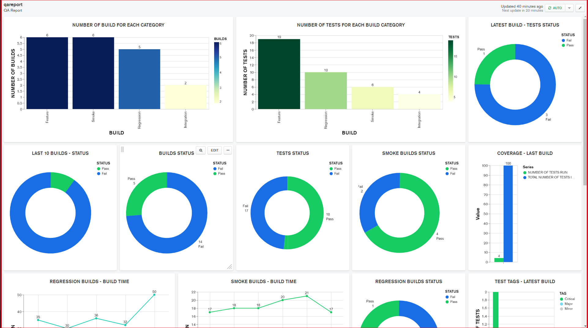
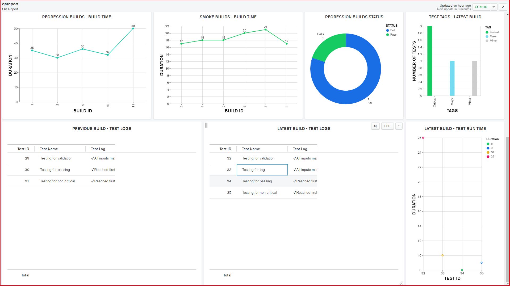
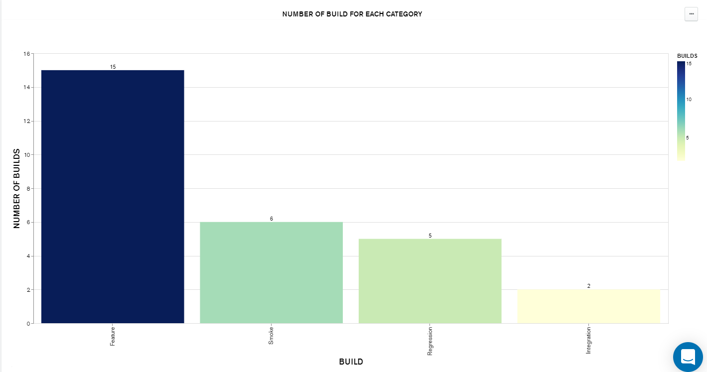
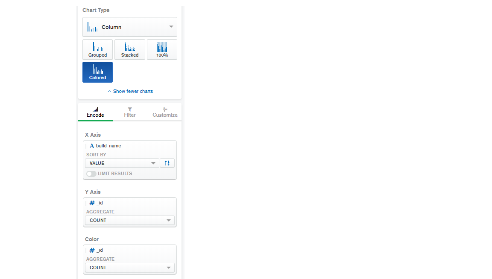

# automationreport

automationreport generates automation test reports in MongoDB which can be visualized with MongoDB Charts.

## Maven Dependency
    
     <dependency>
         <groupId>com.github.QaReport</groupId>
         <artifactId>automation-report</artifactId>
         <version>1.1.1</version>
     </dependency>
     
## Requirements

1. **MongoDB instance**-*Community edition of MongoDB can be downloaded [here](https://docs.mongodb.com/manual/administration/install-community/) and installation guide can be found [here](https://docs.mongodb.com/guides/server/install/).*
2. **Mongo Charts instance**-*Community edition of MongoDB Charts can be downloaded [here](https://www.mongodb.com/download-center/charts) and installation guide can be found [here](https://docs.mongodb.com/charts/current/installation/).*

## Project Structure

    ├── qareport               
    |       ├── QaReport
    |       ├── QaReportException
    |       ├── Status
    |       ├── TestStatus
    |
    ├── .gitignore
    ├── LICENSE
    ├── README.md
    ├── pom.xml      
         

## Usage Guide

***setConnection(mongoUrl, projectName, reportName)*** sets the connection to the mongo instance, creates a database with project name if it doesn't exist and creates a document in the build Collection with build name set to report name.

    Example : setConnection("localhost:9000", "Your Project", "Smoke");

***createTest(testName, Status)*** creates a test under the created build with test name set to the test name parameter and status which can be selected among Critical, Major and Minor.

    Example : createTest("This is the test name", Status.CRITICAL);

***log(log, TestStatus)*** creates a log for the test being run and the Test Status is for mentioning the type of log (currently Pass or Fail). When set to fail updates the status of the test being run to fail.

    Example : log("This validation passed", TestStatus.PASS);

***failTest()*** fails the test being run. It can be used when a log statement couldn't be reached because of unexpected errors. It can be used with @After methods.

***failBuild()*** fails the build which is being run. It can be used when unexpected errors occur.

## Database Structure
    
    ├── Database-Project Name               
       ├── Collection - builds     # Contains build documents
       ├── Collection - tests      # Contains test documents
   
## MongoDB Charts

   
   
   
   
## MongoDB Charts - Instructions on Setting up Dashboard

   The datasource should be added - The Name of the database is the project name used in setConnection().
    
### Setting up charts on Dashboard

 

           
